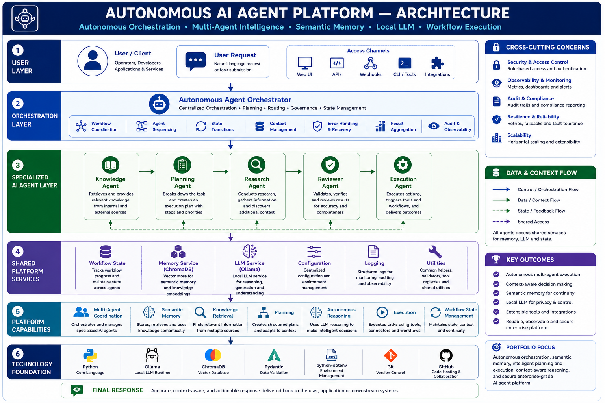

\# Autonomous AI Agent Platform


## Table of Contents

- [Overview](#overview)
- [Quick Start](#quick-start)
- [Key Features](#key-features)
- [Repository Highlights](#repository-highlights)
- [Business Outcomes](#business-outcomes)
- [Architecture Diagram](#architecture-diagram)
- [System Architecture](#system-architecture)
- [Architecture Documentation](#architecture-documentation)
- [Technology Stack](#technology-stack)
- [Project Structure](#project-structure)
- [Installation](#installation)
- [Configuration](#configuration)
- [Running the Application](#running-the-application)
- [Example Workflow](#example-workflow)
- [Screenshots](#screenshots)
- [Future Enhancements](#future-enhancements)
- [Release Information](#release-information)
- [License](#license)
- [Author](#author)

\## Overview


The Autonomous AI Agent Platform is an enterprise-inspired multi-agent AI system designed to demonstrate how autonomous agents can collaborate to solve complex user requests through orchestrated reasoning, persistent memory, and large language models.


The platform coordinates multiple specialized AI agents, each responsible for a specific stage of the workflow. A central Agent Orchestrator manages the execution pipeline, while a shared LLM service powered by Ollama enables natural language reasoning. ChromaDB provides persistent semantic memory, allowing the platform to retrieve relevant workflow history and improve contextual understanding across executions.


The project demonstrates modern AI engineering practices, including modular architecture, agent orchestration, workflow state management, retrieval-augmented memory, centralized configuration, structured logging, and enterprise-style software design.


This project demonstrates the practical implementation of an enterprise-inspired autonomous AI platform using modular AI agents, persistent semantic memory, and local large language models. The platform showcases modern AI engineering practices through production-oriented architecture, orchestration, and documentation.

## Quick Start

Follow these commands to get the project running locally.

```bash
# Clone the repository
git clone https://github.com/<your-github-username>/autonomous-ai-agent-platform.git

# Navigate to the project directory
cd autonomous-ai-agent-platform

# Create and activate a virtual environment
python -m venv venv

# Windows
venv\Scripts\activate

# Install dependencies
pip install -r requirements.txt

# Pull the required Ollama models
ollama pull llama3.2
ollama pull nomic-embed-text

# Launch the application
python main.py
```

For detailed installation instructions and configuration options, see the **Installation** and **Configuration** sections below.

\## Key Features


\- Enterprise-inspired multi-agent AI architecture

\- Centralized Agent Orchestrator for workflow management

\- Specialized AI agents for Knowledge, Planning, Research, Review, and Execution

\- Shared LLM service powered by Ollama

\- Persistent semantic memory using ChromaDB

\- Metadata-driven memory classification and retrieval

\- Workflow state management using Pydantic models

\- Modular and scalable project structure

\- Centralized configuration and constants management

\- Structured logging for application observability

\- End-to-end autonomous workflow execution

\- Enterprise-style coding standards, documentation, and project organization

## Repository Highlights

- Enterprise-inspired autonomous AI agent platform with modular architecture
- Centralized Agent Orchestrator coordinating specialized AI agents
- Retrieval-Augmented Generation (RAG) using ChromaDB for persistent semantic memory
- Local LLM inference powered by Ollama and Llama 3.2
- Workflow state management using Pydantic models
- Structured logging and centralized configuration
- Production-oriented project structure following AIGA Engineering Standards
- Comprehensive documentation with architecture diagrams and implementation guides

---

## Business Outcomes

The Autonomous AI Agent Platform demonstrates how modular AI agents can be orchestrated to solve complex tasks through coordinated reasoning, persistent memory, and structured execution.

### Key Outcomes

- Modular multi-agent architecture for scalable AI workflows
- Separation of responsibilities through specialized AI agents
- Persistent semantic memory for contextual reasoning
- Local LLM inference for privacy-focused enterprise deployments
- Extensible orchestration framework supporting future AI capabilities
- Reusable platform architecture suitable for enterprise AI solutions
- Production-inspired software engineering practices and documentation

---

## Architecture Diagram

The following diagram illustrates the enterprise architecture of the Autonomous AI Agent Platform, including the orchestration layer, specialized AI agents, shared platform services, semantic memory, local LLM integration, workflow state management, and execution pipeline.

<p align="center">
  
</p>

---

\## System Architecture


The platform follows a modular, enterprise-inspired architecture where a central Agent Orchestrator coordinates multiple specialized AI agents. Each agent is responsible for a specific stage of the workflow while sharing common services such as the LLM interface, persistent memory, logging, and configuration.


\### Architectural Highlights


\- Centralized orchestration of autonomous AI agents

\- Shared workflow state across all agents

\- Persistent semantic memory using ChromaDB

\- Shared LLM interface powered by Ollama

\- Modular design with clear separation of responsibilities

\- Extensible architecture for adding future agents and capabilities


## Architecture Documentation

The project includes detailed architecture documents located in the `docs/architecture` directory.

| Document | Description |
|----------|-------------|
| `system_architecture.md` | High-level system architecture and major components |
| `agent_orchestration.md` | Runtime orchestration and collaboration between AI agents |
| `deployment_architecture.md` | Runtime deployment of application components |
| `knowledge_retrieval.md` | Retrieval-Augmented Generation (RAG) workflow |


## Technology Stack

| Category | Technology | Purpose |
|----------|------------|---------|
| Programming Language | Python 3.13 | Primary implementation language used to build the complete Autonomous AI Agent Platform with a modular and extensible architecture. |
| Large Language Model | Ollama (Llama 3.2) | Provides local LLM inference for autonomous reasoning, planning, knowledge synthesis, and response generation without relying on external cloud services. |
| Vector Database | ChromaDB | Stores and retrieves semantic memories, enabling contextual recall, knowledge persistence, and long-term memory across workflow executions. |
| Embedding Model | nomic-embed-text | Generates semantic vector embeddings to support similarity search and efficient knowledge retrieval. |
| Workflow Orchestration | Agent Orchestrator | Coordinates workflow execution, manages state transitions, and orchestrates collaboration among specialized AI agents. |
| Specialized AI Agents | Knowledge, Planning, Research, Reviewer, Execution | Modular AI agents with clearly defined responsibilities that collaboratively perform reasoning, planning, research, validation, and execution within autonomous workflows. |
| Data Validation | Pydantic | Defines strongly typed workflow models and validates application configuration for improved reliability and maintainability. |
| Configuration Management | python-dotenv | Externalizes environment-specific settings, enabling secure and flexible application configuration across deployment environments. |
| Logging & Diagnostics | Python Logging | Provides centralized logging to support monitoring, debugging, and operational observability. |
| Unique Identifier Management | uuid | Generates globally unique identifiers for workflow instances, execution sessions, and persistent memory records. |
| Version Control | Git | Maintains source code history and supports collaborative software development. |
| Repository Hosting | GitHub | Hosts the project source code, documentation, architecture diagrams, release history, and versioned software artifacts. |


\## Project Structure


```text

autonomous-ai-agent-platform/

│

├── app/

│   ├── agents/             # AI agent implementations

│   ├── config/             # Configuration, constants, and settings

│   ├── models/             # Workflow state and data models

│   ├── orchestration/      # Agent orchestration logic

│   ├── services/           # LLM, memory, and shared services

│   └── utils/              # Common utility modules

│

├── data/                   # ChromaDB persistent storage

├── logs/                   # Application log files

├── main.py                 # Application entry point

├── streamlit\_app.py        # Streamlit user interface

├── requirements.txt        # Python dependencies

├── .env.example            # Sample environment configuration

├── .gitignore              # Git ignore rules

└── README.md               # Project documentation

```


\### Directory Responsibilities


| Directory | Responsibility |

|-----------|----------------|

| `agents` | Specialized AI agents responsible for each workflow stage |

| `config` | Centralized configuration, application settings, and constants |

| `models` | Workflow state and shared data models |

| `orchestration` | Coordinates execution across all AI agents |

| `services` | Shared services including Ollama integration and ChromaDB memory |

| `utils` | Reusable helper utilities |

| `data` | Persistent vector database storage |

| `logs` | Application execution logs |


\## Installation


\### Prerequisites


Before running the project, ensure the following software is installed:


\- Python 3.13 or later

\- Git

\- Ollama

\- ChromaDB (installed through `requirements.txt`)


\### Clone the Repository


```bash

git clone https://github.com/a341499/autonomous-ai-agent-platform.git


cd autonomous-ai-agent-platform

```


\### Create a Virtual Environment


\*\*Windows\*\*


```bash

python -m venv venv


venv\\Scripts\\activate

```


\*\*Linux / macOS\*\*


```bash

python3 -m venv venv


source venv/bin/activate

```


\### Install Dependencies


```bash

pip install --upgrade pip


pip install -r requirements.txt

```


\### Configure Environment Variables


Create a local environment file from the provided template.


```bash

copy .env.example .env

```


Update the required values inside `.env` before running the application.


\### Pull the Ollama Model


Download the language model used by the project.


```bash

ollama pull llama3.2

```


Download the embedding model.


```bash

ollama pull nomic-embed-text

```


The project is now ready to run.


\## Configuration


The application uses environment variables for configuration. Copy the sample configuration file before running the project.


```bash

copy .env.example .env

```


Configure the following environment variables as required.


| Variable | Description | Example |

|----------|-------------|---------|

| `LLM\_MODEL` | Ollama language model used by the platform | `llama3.2` |

| `EMBEDDING\_MODEL` | Embedding model used for semantic search | `nomic-embed-text` |

| `CHROMA\_DB\_PATH` | Directory for persistent ChromaDB storage | `./data/chromadb` |

| `LOG\_LEVEL` | Application logging level | `INFO` |


\### Example `.env`


```text

LLM\_MODEL=llama3.2

EMBEDDING\_MODEL=nomic-embed-text

CHROMA\_DB\_PATH=./data/chromadb

LOG\_LEVEL=INFO

```


> \*\*Note\*\*

>

> Do not commit your local `.env` file to GitHub. Only commit `.env.example`.


\## Running the Application


\### Start Ollama


Ensure the Ollama service is running before starting the application.


Verify the installed models:


```bash

ollama list

```


\### Launch the Application


Run the main application.


```bash

python main.py

```


If the project includes the Streamlit user interface, launch it using:


```bash

streamlit run streamlit\_app.py

```


\### Expected Startup Sequence


When the application starts successfully, you should observe the following sequence:


1\. Application initialization

2\. Configuration loading

3\. Logging initialization

4\. ChromaDB initialization

5\. Memory Service initialization

6\. Agent Orchestrator initialization

7\. AI agent initialization

8\. Workflow execution

9\. Workflow completion

10\. Final response generation


\### Example Workflow


```text

User Request → Agent Orchestrator → Knowledge Agent → Planning Agent → Research Agent → Reviewer Agent → Execution Agent → Workflow Summary → Persistent Memory (ChromaDB) → Final Response.

```


\### Successful Execution


A successful execution will:


\- Initialize all platform components

\- Execute the complete multi-agent workflow

\- Generate a final response

\- Store the workflow summary in ChromaDB

\- Mark the workflow status as \*\*COMPLETED\*\*


\## Example Workflow


\### Sample User Request


```text

Design a high-level implementation plan for an enterprise AI knowledge platform.

```


\### Workflow Execution


The Agent Orchestrator coordinates the following execution pipeline:


| Step | Agent | Responsibility |

|------|--------|----------------|

| 1 | Knowledge Agent | Retrieve relevant context and knowledge |

| 2 | Planning Agent | Generate a structured implementation plan |

| 3 | Research Agent | Perform additional analysis and recommendations |

| 4 | Reviewer Agent | Review the generated solution for completeness |

| 5 | Execution Agent | Produce the final consolidated response |


\### Example Execution Flow


```text

\### Example Execution Flow


```text

User Request → Knowledge Agent → Planning Agent → Research Agent → Reviewer Agent → Execution Agent → Workflow Summary → Memory Service → Final Response

```


\### Example Final Response


```text

Enterprise AI Knowledge Platform implementation plan generated successfully.


• Knowledge gathered from semantic memory

• Execution plan created

• Research recommendations incorporated

• Solution reviewed for completeness

• Final response generated and stored in persistent memory

```


\### Workflow Persistence


After successful execution, the platform stores:


\- Workflow identifier

\- User request

\- Knowledge summary

\- Execution plan

\- Research findings

\- Review comments

\- Final execution result

\- Workflow metadata


This persistent memory enables future workflow retrieval and provides contextual information for subsequent executions.


\## Screenshots


The following screenshots demonstrate the platform's key capabilities.


\### Application Startup


> \*\*Description\*\*

>

> Shows successful application initialization, configuration loading, and AI agent startup.


\*Screenshot Placeholder\*


\---


\### Workflow Execution


> \*\*Description\*\*

>

> Demonstrates the sequential execution of the Knowledge, Planning, Research, Reviewer, and Execution agents.


\*Screenshot Placeholder\*


\---


\### Memory Retrieval


> \*\*Description\*\*

>

> Shows retrieval of relevant workflow memories from ChromaDB using metadata-based filtering.


\*Screenshot Placeholder\*


\---


\### Workflow Completion


> \*\*Description\*\*

>

> Displays the final workflow status, execution summary, and generated response.


\*Screenshot Placeholder\*


\---


\### Streamlit User Interface \*(if applicable)\*


> \*\*Description\*\*

>

> Demonstrates the interactive user interface for submitting requests and viewing workflow execution.


\*Screenshot Placeholder\*


\## Future Enhancements


The current release (\*\*v1.0.0\*\*) establishes the architectural foundation for an autonomous multi-agent AI platform. Future releases may introduce the following capabilities:


\- Multi-agent collaboration and negotiation

\- Parallel workflow execution

\- Human-in-the-loop approval workflows

\- Tool calling and MCP integration

\- Enterprise connector framework

\- REST API services

\- WebSocket-based real-time communication

\- Authentication and role-based access control

\- Workflow scheduling and automation

\- Monitoring and observability dashboards

\- Agent performance analytics

\- Conversation history management

\- Long-term memory optimization

\- Distributed workflow execution

\- Containerization with Docker

\- Kubernetes deployment

\- CI/CD pipeline integration

\- Automated testing framework

\- Cloud deployment support


Future enhancements will be introduced through versioned releases while preserving the stability of the v1.0.0 implementation.


## Release Information

| Attribute | Value |
|-----------|-------|
| **Current Version** | v1.0.0 |
| **Release Status** | Stable |
| **Project Status** | Complete |
| **Documentation** | Complete |
| **Architecture Diagrams** | Complete |
| **License** | MIT |

### Repository Highlights

- Enterprise-inspired autonomous AI agent platform
- Modular and scalable architecture
- Multi-agent orchestration with persistent memory
- Retrieval-Augmented Generation (RAG) workflow
- Production-oriented project organization and documentation

\## License


This project is released for portfolio and educational purposes.


You are welcome to explore the architecture, implementation approach, and engineering practices demonstrated in this repository.


Please refer to the repository license for detailed usage terms.


\## Author


\*\*Lokesh Kumar\*\*


Principal Database Engineer with 20+ years of experience designing enterprise-scale database systems and AI-powered engineering solutions.


This project is part of the \*\*AI Generalist Accelerator (AIGA)\*\* portfolio, demonstrating the transition from enterprise database engineering to modern AI systems engineering through hands-on implementation of production-inspired AI platforms.


\- LinkedIn: https://www.linkedin.com/in/a341499/

\- GitHub: https://github.com/a341499

